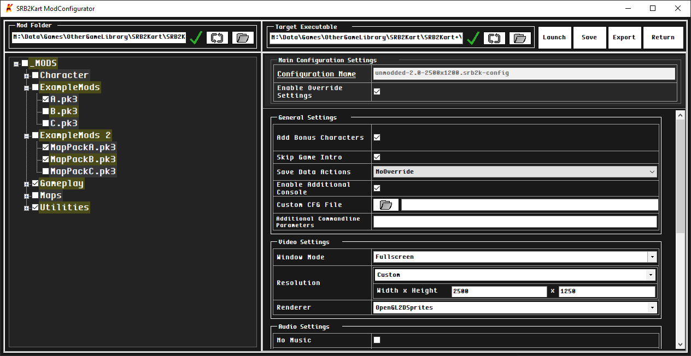

## Project

This project is a simple launcher / mod configurator for the game 'Sonic RoboBlast 2 Kart' - ['SRB2Kart' by Kart Krew](https://mb.srb2.org/threads/srb2kart.25868/). (The tool is primarily made for SRB2Kart, however, this can probably also be used for the base game as well, but I haven't tested that.

The main purpose of the launcher was to make managing mods & mod-packs easier. It also exposes several command-line parameters used to override some game settings in a neater and UI-friendlier way. 

These configurations can be saved to a file, and it can then be used to launch the game with the selected mods and settings. Optionally, the configurations can also be exported to a batch file to open the game with the configured settings right away.

## Features
- Saving & Exporting of Configurations. (JSON/Batch formats)
- Launch the game with saved or WIP configurations.
- Tree folder view of the selected mod folder.
- Quick server joining and server hosting settings. (The user must still port-forward when hosting an online game.)
- The launcher remembers and preloads the last launched configuration.

#### Disclaimers
- I don't write a whole lot of C#/Visual Forms code, so definitely let me know if there are any issues.
- The base SRB2Kart game doesn't allow for fully customized resolutions and higher resolutions above the default. For higher resolutions, you should look into something like ['Moe Mansion'](https://mb.srb2.org/addons/srb2kart-1-3-moe-mansion.42/) instead which replaces your default "srb2k.exe".

#### Licence

See [LICENCSE](https://github.com/TDCRanila/SRB2Kart-ModConfigurator/blob/main/LICENSE);
